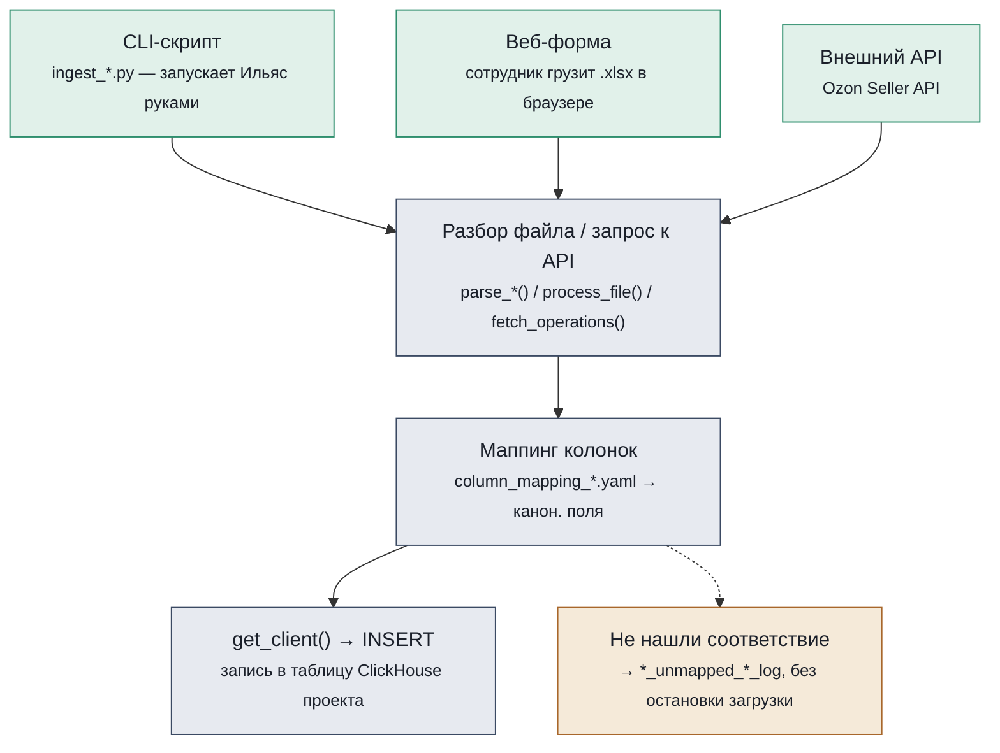
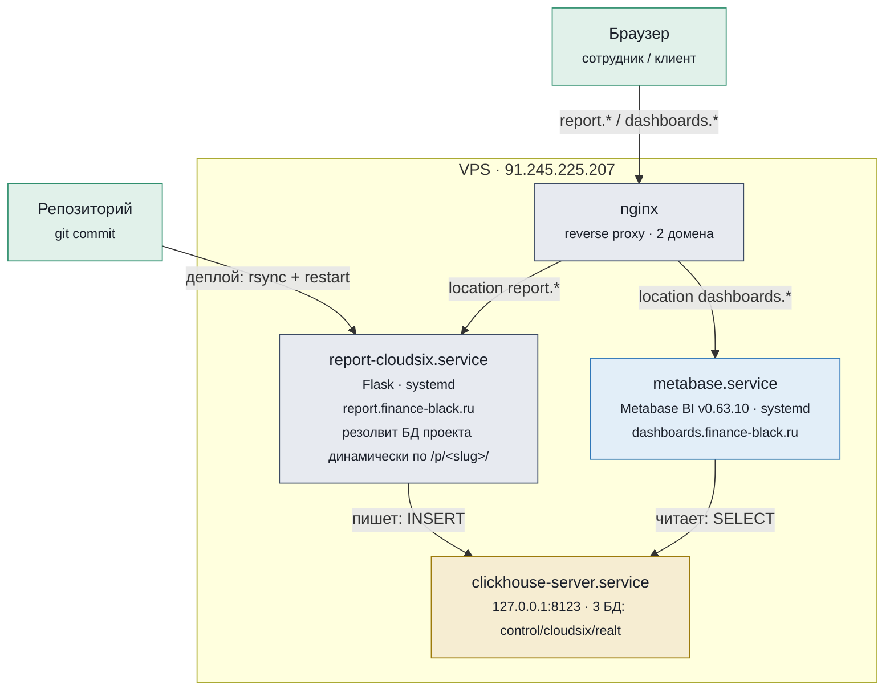
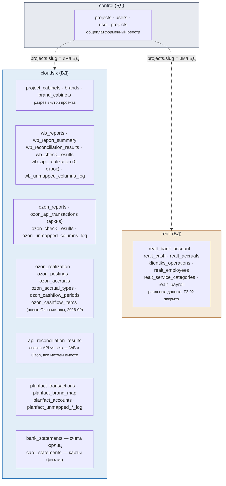
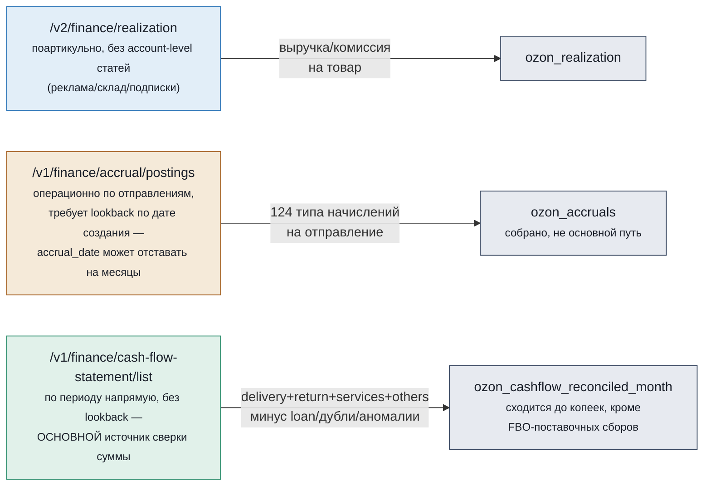
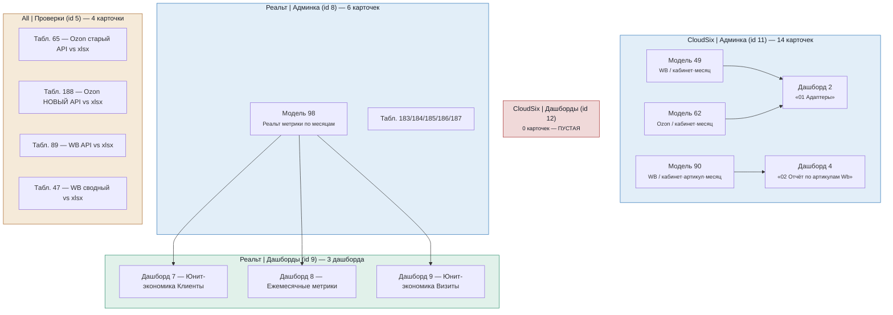

# Карта bf-analytics

Платформа принимает отчёты Wildberries и Ozon, банковские выписки и выгрузки ПланФакта, складывает их в единую базу и превращает в дашборды. Ниже — как это устроено на четырёх уровнях: код, сервисы, база данных, аналитика. Плюс путь одного отчёта и глоссарий — для тех, кто не программист.

Снимок структуры на **2026-09-23** (source of truth: `system.tables` ClickHouse на проде — все 3 БД, Metabase API, код репозитория). Предыдущий снимок был от 2026-09-13 — с тех пор: Ozon-метод `/v3/finance/transaction/list` отключён Ozon насовсем и заменён связкой из трёх новых методов (раздел 3, подробно для CloudSix), Реальт получил реальные данные и клиентский доступ в Metabase (раньше все таблицы `realt` были пустые), Metabase-коллекции CloudSix/Реальт переструктурированы на «Админка»/«Дашборды».

---

## 1. Как работают функции Python

Все загрузчики данных устроены одинаково: файл разбирается (или тянется по API), поля приводятся к общему справочнику названий, и результат пишется в ClickHouse. Различаются только источники — сам механизм один и тот же.

CLI-скрипты (разовые/периодические загрузки), веб-форма (ежедневные отчёты WB) и прямой запрос к API (Ozon) ведут в одни и те же функции — код не дублируется. Строки без соответствия в справочнике не роняют загрузку, а откладываются в лог-таблицу для разбора.

Ключи API резолвятся **по кабинету**, не общим на всю площадку (`src/cabinet_credentials.py`, `secrets/cabinet_api_keys.json`, вне git) — до 2026-09-20 был реальный баг: один и тот же WB/Ozon-ключ использовался для всех `--cabinet`, хотя у каждого кабинета своя учётка на площадке.

Загрузчики — один и тот же механизм, разные источники:

| Источник файла | Скрипт | Ключевая функция | Таблица ClickHouse |
|---|---|---|---|
| Детальный отчёт WB (.xlsx) | `ingest_wb.py` / веб-форма | `wb_core.ingest_files` | `wb_reports` |
| Сводный отчёт WB (.xlsx) | `ingest_wb.py` / веб-форма | `wb_summary_core.ingest_files` | `wb_report_summary` |
| Реализации WB (API) | `ingest_wb_api.py` | `wb_api_core.*` | `wb_api_realization` — **0 строк, загрузка не запускалась** (см. бэклог `docs/vision.md`) |
| Отчёт Ozon «Начисления» (.xlsx) | `ingest_ozon.py` | `ozon_core.ingest_files` | `ozon_reports` |
| Финансовые операции Ozon (API, **исторические**) | `ingest_ozon_api.py` | `ozon_api_core.ingest_period` | `ozon_api_transactions` — источник (`/v3/finance/transaction/list`) отключён Ozon в 2026 г., новых данных не будет; таблица оставлена как архив, замена — три строки ниже |
| Поартикульная выручка Ozon (API) | `ingest_ozon_realization.py` | `ozon_realization_core.ingest_month` | `ozon_realization` |
| Операционная детализация Ozon по отправлениям (API) | `ingest_ozon_accrual.py` | `ozon_accrual_core.ingest_month` | `ozon_accruals`, `ozon_postings`, `ozon_accrual_types` |
| Взаиморасчёты Ozon по периодам (API) | `ingest_ozon_cashflow.py` | `ozon_cashflow_core.ingest_month` | `ozon_cashflow_periods`, `ozon_cashflow_items` |
| Банковская выписка 1С (.txt) | `ingest_bank_statements.py` | `bank_statement_1c.parse_dir` | `bank_statements` |
| Справка по карте физлица (.pdf) | `ingest_card_statements.py` | `card_statement_pdf.parse_dir` | `card_statements` |
| Выгрузка ПланФакта (.xlsx) | `ingest_planfact.py` | `planfact_xlsx.parse_xlsx` | `planfact_transactions` |
| Справочник брендов (Google Sheets) | `ingest_planfact_brand_map.py` | `parse_brand_map` / `parse_accounts` | `planfact_brand_map`, `planfact_accounts` |

**Реальт (клиника) больше не «в процессе»** — с ТЗ 02 (завершено, см. вики) у Реальта рабочие источники (Клиентикс, банк/наличные/начисления через Google-Таблицы, ФОТ) и реальные данные в БД `realt` (раздел 3). Загрузка идёт не CLI-скриптами по образцу WB/Ozon, а отдельными Google-Таблицами — детали не в этом документе, см. `docs/formulas/realt.tex` и вики-заметки по Реальту.

---

## 2. Как связаны сервисы

Всё живёт на одном VPS. nginx решает, какой домен куда вести; веб-приложение только пишет данные, Metabase — только читает.

Один сервис пишет, другой только читает — Flask-приложение никогда не читается напрямую сотрудником для аналитики, а Metabase никогда не пишет в ClickHouse. Код на VPS обновляется вручную командой `scripts/deploy.sh` (rsync + перезапуск systemd), автодеплоя по пушу нет.

Название `report-cloudsix.service` — историческое (сервис создавался под первого и на тот момент единственного клиента); он обслуживает несколько проектов через один и тот же процесс, выбирая БД по `/p/<slug>/` в URL, а не по своему имени.

Локальная работа с прод-ClickHouse (снаружи недоступен) — SSH-туннель `ssh -L 8123:127.0.0.1:8123 root@<host>` (в этой рабочей среде — без `sshpass`, туннель держится Python-процессом через `paramiko`, т.к. `sshtunnel`-библиотека несовместима с новыми версиями `paramiko`). Metabase на самом VPS обращается к ClickHouse напрямую, без туннеля — туннель нужен только для локальной работы с базой из этого репозитория.

---

## 3. Что лежит в ClickHouse

Три физические БД. `control` — общеплатформенный реестр (кто есть кто), у каждого проекта-клиента — своя отдельная БД (имя = `projects.slug`) с бизнес-таблицами этого клиента: `cloudsix` и `realt` (обе с реальными данными).

Бренд для операции ПланФакта не записан в саму строку — он вычисляется JOIN'ом с `planfact_brand_map` в момент чтения. Это осознанное решение: справочник брендов меняется чаще, чем хочется перезаливать 23 тысячи строк.

### control

| Таблица | Строк | Назначение |
|---|---:|---|
| `projects` | 2 | Проекты-клиенты (CloudSix, Realt) |
| `users` | 3 | Сотрудники/клиенты с доступом к платформе |
| `user_projects` | 6 | Какому пользователю какие проекты видны |

### cloudsix

| Таблица | Группа | Строк | Назначение |
|---|---|---:|---|
| `project_cabinets` | ядро | 15 | Кабинеты площадки, привязанные к проекту |
| `brands` | ядро | 13 | Бренды внутри проекта — каждый на своём ИП/ООО |
| `brand_cabinets` | ядро | 15 | Связь бренда с конкретным кабинетом площадки |
| `wb_reports` | WB | 775 319 | Сырые строки детального отчёта WB |
| `wb_report_summary` | WB | 506 | Итоговые цифры сводного отчёта — для сверки |
| `wb_reconciliation_results` | WB | 6 072 | Результат сверки детального и сводного отчётов (ReplacingMergeTree — без FINAL считает версии, не уникальные проверки) |
| `wb_check_results` | WB | 54 | Технические проверки качества загрузки |
| `wb_api_realization` | WB | **0** | Реализации WB по API — **загрузка не запускалась**, см. `docs/vision.md` → бэклог |
| `wb_unmapped_columns_log` | WB | 34 | Колонки отчёта, не найденные в справочнике маппинга |
| `ozon_reports` | Ozon | 888 101 | Сырые строки отчёта Ozon «Начисления» (ручная .xlsx-выгрузка). **Ручные выгрузки не обновлялись с середины июня 2026** ни по одному кабинету — самый свежий месяц с данными сильно расходится между кабинетами |
| `ozon_api_transactions` | Ozon (архив) | 179 434 | Операции по мёртвому `/v3/finance/transaction/list` — данные загружены до отключения метода (покрывают Jan–Sep для CloudSix), новых больше не будет |
| `ozon_check_results` | Ozon | 42 | Технические проверки качества загрузки |
| `ozon_unmapped_columns_log` | Ozon | 0 | Колонки .xlsx, не найденные в справочнике маппинга |
| `ozon_realization` | Ozon (новый) | 101 311 | Поартикульная выручка/комиссия по месяцу (`/v2/finance/realization`), все 8 кабинетов, Jan–Aug 2026 |
| `ozon_postings` | Ozon (новый) | 22 922 | Список отправлений FBS/FBO — служебная таблица под `ozon_accruals` (см. ниже) |
| `ozon_accruals` | Ozon (новый) | 91 039 | Операционная детализация по отправлениям (`/v1/finance/accrual/postings`), 124 типа начислений — тестово, не основной источник (см. врезку ниже) |
| `ozon_accrual_types` | Ozon (новый) | 125 | Справочник типов начислений (124 от Ozon + 1 синтетический `SellerRevenue`) |
| `ozon_cashflow_periods` | Ozon (новый) | 229 | Взаиморасчёты по периодам выплат (`/v1/finance/cash-flow-statement/list`), **основной источник сверки суммы к перечислению** |
| `ozon_cashflow_items` | Ozon (новый) | 3 553 | Итемизированная разбивка cash-flow по статьям (реклама/хранение/подписки и т.д.) |
| `api_reconciliation_results` | сверка | 235 | Сверка «API vs .xlsx» по метрикам модели — WB и все Ozon-методы (старый и новый) в одной таблице (`platform`+`metric`) |
| `planfact_transactions` | кэшфлоу | 23 591 | Сырая выгрузка операций из ПланФакта |
| `planfact_brand_map` | кэшфлоу | 15 | Справочник «проект ПланФакта → бренд/площадка» |
| `planfact_accounts` | кэшфлоу | 58 | Справочник банковских счетов ПланФакта |
| `planfact_category_mapping` | кэшфлоу | 0 | Заготовка под маппинг статей (пока не заполнена) |
| `planfact_unmapped_project_log` | кэшфлоу | 1 | Строки без бренда/площадки при загрузке |
| `planfact_unmapped_statya_log` | кэшфлоу | 0 | Строки без статьи при загрузке |
| `bank_statements` | банк | 13 854 | Сырые банковские выписки 1С — р/с юрлиц |
| `card_statements` | банк | 14 870 | Справки по картам физлиц (из PDF) |

Плюс VIEW с формулами метрик (не таблицы с данными — см. раздел 4): `wb_metrics_by_cabinet_month`, `wb_metrics_by_sku_month`, `ozon_metrics_by_cabinet_month`, `ozon_metrics_by_cabinet_month_api`, `ozon_cashflow_reconciled_month`.

#### Врезка: три Ozon-метода и почему их три, а не один

`/v3/finance/transaction/list` (источник `ozon_api_transactions`) Ozon отключил в 2026 году насовсем (`{"code":9,"message":"obsolete method cannot be used"}`). Замена — не один метод, а связка из трёх, у каждого своя роль и свой структурный пробел:

`cash-flow-statement` выбран основным источником сверки, а не `accrual/postings`, по двум причинам: (1) запрашивается напрямую по месяцу, без lookback на десятки-сотни дней назад ради одного отчётного периода; (2) `accrual/postings` в принципе не видит расходы, не привязанные к `posting_number` (реклама, подписки, склад) — структурный пробел, не техническая недоработка. В самом ответе Ozon по `cash-flow-statement` найден и обойдён реальный баг — статья `MarketplaceServiceItemDeliveryToHandoverPlaceOzon` (с апреля 2026) задвоена между `delivery.delivery_services.items` и `services.items`, формула в `ozon_cashflow_reconciled_month` вычитает вторую копию (правило общее по совпадению `item_name`, не привязано к конкретному имени статьи — см. вики-заметку в knowledge).

После всех поправок формула сходится с `.xlsx`/`ozon_api_transactions` до копеек на 3 из 6 проверенных кабинетов (Torado, Lampa) и до нескольких тысяч ₽/месяц на остальных — остаток **на 100% объяснён поимённо**: категории «Временное размещение товара партнерами»/«Упаковка товара партнёрами» (FBO-поставочные сборы, привязаны к номеру поставки на склад, не к продаже) отсутствуют во всех проверенных новых методах Ozon — задокументированный, не устранённый пробел покрытия площадки, не баг платформы.

**Известная проблема данных, не архитектуры:** кабинет **X-Tech** — в `.xlsx` реальные обороты (8–14 млн ₽/мес), а по всем API-методам (включая `cash-flow-statement`) почти везде 0. Похоже, Client-Id/Api-Key в `secrets/cabinet_api_keys.json` для X-Tech всё ещё привязан не к тому кабинету (см. вики, session log 2026-09-23) — требует уточнения у пользователя, не наша ошибка запроса.

### realt

Схема (`realt_bank_account`, `realt_cash`, `realt_accruals`, `klientiks_operations`, `realt_employees`, `realt_service_categories`, `realt_payroll` + VIEW `realt_metrics_by_month`/`realt_pl_by_group_month`/`realt_doctor_month`/`realt_role_month`/`realt_visits_categorized`/`realt_payroll_categorized`) с реальными данными — ТЗ 02 закрыто, дашборды в Metabase работают (раздел 4). `bank_statements`/`card_statements` в этой БД заведены по аналогии с CloudSix, но пока 0 строк (Реальт эти источники не использует).

---

## 4. Как устроен Metabase

Формула метрики живёт один раз — в Модели (тонкая обёртка над ClickHouse VIEW с `COMMENT COLUMN`, см. ниже). Всё остальное на неё ссылается, а не копирует SQL заново.

**С 2026-09-21 структура коллекций сменилась на «Админка»/«Дашборды» на клиента** (было — одна плоская коллекция «Отчеты» на всех). Плюс переименована бывшая «Тесты / Чеки» → **`All | Проверки`** (сверки WB/Ozon по всем клиентам вместе, id 5).

**Найдено при снятии этого снимка (2026-09-23), не исправлено:** `CloudSix | Дашборды` (id 12) — **пустая коллекция**, ни одной карточки. Все реальные дашборды CloudSix (2, 4) физически лежат в `CloudSix | Админка` (11), а не в «Дашборды» — структура скопирована с Реальта только наполовину (сама коллекция создана, перенос содержимого не сделан). У Реальта тот же паттерн, но там дашборды (7/8/9) действительно лежат в «Дашборды» (9), а сопутствующие карточки — в «Админка» (8). Для CloudSix сейчас нет отдельного ограниченного пользователя-клиента (в отличие от Реальта — Виолетта), поэтому на практике это пока не ломает доступ никому, но если такой пользователь появится, он упрётся в ту же пустую оболочку, что чинили для Виолетты (см. врезку про Metabase-права ниже) — стоит либо перенести дашборды 2/4 в коллекцию 12, либо просто не заводить её и работать как раньше единой коллекцией.

**Право на коллекцию дашборда ≠ право на карточки внутри него.** Разбирали на кейсе Виолетты (Реальт-клиент, 2026-09-22): у её группы был `read` на `Реальт | Дашборды`, но дашборды открывались пустыми — карточки внутри физически лежат в `Реальт | Админка`, а Metabase не наследует доступ дашборда на его карточки. Плюс отдельный (третий) слой прав — `view-data` на саму базу данных (`permissions/graph`, не `collection/graph`) — тоже был `legacy-no-self-service` (= нет доступа). Оба слоя починены точечно (только база `ClickHouse Realt`, id 3; CloudSix, id 2, остался заблокирован для этой группы). Подробности и как диагностировать — вики, `knowledge/integrations/Metabase — доступ к коллекции дашборда не распространяется на карточки в другой коллекции.md`.

Модели 49/62/90/98 — единственное место, где считаются формулы метрик (все — тонкие обёртки над ClickHouse VIEW с `COMMENT COLUMN` на каждой колонке, см. `src/schema_wb_metrics_views.sql` / `src/schema_ozon_metrics_views.sql`). Новый VIEW `ozon_cashflow_reconciled_month` (2026-09-23) следует той же конвенции (`COMMENT COLUMN` применён 2026-09-23), но пока **не обёрнут отдельной Metabase Model** — карточка 188 читает напрямую общую `api_reconciliation_results`, а не сам VIEW; если понадобится вывести детализацию по статьям (`ozon_cashflow_items`) в Metabase — тогда и понадобится Model.

Карточки-Таблицы существуют для ручных проверок (детальные отчёты, сверки), Визуалы — то, что реально выведено на дашборд (правило «на дашборде только Визуалы», с осознанным исключением для Реальта — ratio-метрики в native-SQL Таблицах, см. `.claude/knowledge/architecture-standarts.md`).

## AI-бот и семантический слой

Платформа готовится к тому, что поверх встанет AI-бот, отвечающий на аналитические вопросы. Архитектура доступа к данным для него (решение 2026-09-05, полное обоснование — `.claude/knowledge/architecture-standarts.md` → «Семантический слой для AI-бота»):

1. **Сначала Metabase REST API** — бот вызывает уже готовые Model/Metric через `POST /api/card/:id/query`, не гоняя большие данные в ClickHouse заново под уже посчитанный вопрос.
2. **Ad-hoc SQL к ClickHouse — только запасной путь**, если вопрос не покрыт существующей моделью, через отдельного read-only пользователя (завести до подключения бота к БД — **ещё не сделано**) и по VIEW-слою с `COMMENT COLUMN`, а не по сырым таблицам.
3. **OpenMetadata не берём** — рассчитан на multi-source enterprise-каталоги, у нас один ClickHouse и один Metabase, лишний сервис не окупается при текущем масштабе.

Разграничение по трём физическим БД (раздел 3) не меняет эту архитектуру — read-only пользователь для бота нужно будет завести на каждую БД клиента отдельно, см. бэклог «Узкие ClickHouse-пользователи для Metabase» в `docs/vision.md`.

---

## 5. Путь одного отчёта

Что происходит между «выгрузил файл из личного кабинета» и «увидел цифру в дашборде» — по шагам (на примере WB; для Ozon то же самое, только раздел «Загрузка» может быть либо .xlsx через тот же принцип, либо автоматическим запросом к API без участия сотрудника):

1. **Выгрузка** — сотрудник скачивает отчёт из личного кабинета WB в .xlsx (или платформа сама запрашивает Ozon API по расписанию/руками через `ingest_ozon_*.py`)
2. **Загрузка** — заходит на report.finance-black.ru, выбирает проект и кабинет, загружает файл (для API-источников — этот шаг пропускается)
3. **Разбор** — платформа читает файл/ответ API, приводит колонки к общему виду, пишет строки в ClickHouse (в БД нужного проекта)
4. **Сверка** — для сводного отчёта и для API-источников сразу считается сверка с независимым источником (`*_reconciliation_results`/`api_reconciliation_results`)
5. **Модель** — Metabase пересчитывает формулы метрик заново при каждом открытии, без ручного шага
6. **Дашборд** — на dashboards.finance-black.ru видна выручка, маржа и удержания площадки

---

## 6. Глоссарий

Слова, которые платформа использует в специфичном смысле.

**Проект**
Клиент платформы (сейчас два — CloudSix и Реальт, оба с реальными данными). Верхний уровень, к которому привязаны пользователи, кабинеты и бренды; у каждого проекта — своя физическая БД в ClickHouse.

**Кабинет**
Учётная запись продавца на площадке (WB, Ozon). Один проект может держать несколько кабинетов.

**Бренд**
Товарная линейка внутри проекта, обычно оформленная на своё юрлицо/ИП. У CloudSix — 13 брендов на 13 юрлицах внутри одного проекта.

**Модель** (Metabase Model)
Зафиксированный SQL-запрос с формулами метрик — тонкая обёртка над ClickHouse VIEW. Единственное место, где формула написана словами — остальные карточки на неё ссылаются (`{{#id}}`), а не копируют код.

**Метрика** (Metabase Metric)
Готовая агрегация поверх Модели (например, сумма по колонке «Продажи»), которую можно переиспользовать как блок в других карточках.

**Сверка**
Автоматическое сравнение цифр между двумя независимыми источниками одной и той же площадки — либо детальный vs сводный отчёт внутри WB (`wb_reconciliation_results`), либо API vs .xlsx для WB/Ozon (`api_reconciliation_results`), причём и по общей сумме, и по каждой метрике модели отдельно. Для Ozon сейчас в одной таблице сосуществуют результаты старого (`/v3/finance/transaction/list`) и нового (`cash-flow-statement`) методов — различаются полем `metric`.

**ingest**
Загрузка сырого файла или ответа API в ClickHouse: разбор/запрос → маппинг колонок → запись строк.

**COMMENT COLUMN**
Человекочитаемое описание формулы/смысла колонки, записанное прямо в ClickHouse (`ALTER TABLE ... COMMENT COLUMN`) на VIEW-слое метрик. Источник истины для Metabase-подсказок и будущего AI-бота — не дублируется в тексте Model отдельно.

---

*bf-analytics-platform · снимок структуры на 2026-09-23 · источники: `system.tables` ClickHouse (control/cloudsix/realt), Metabase API, код репозитория*
