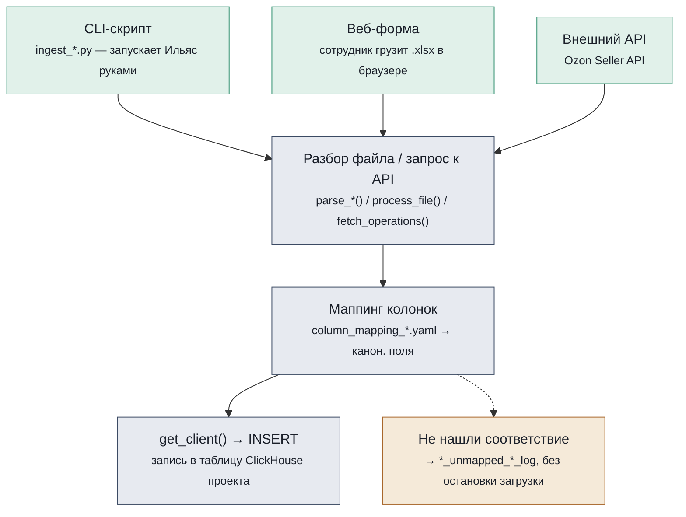
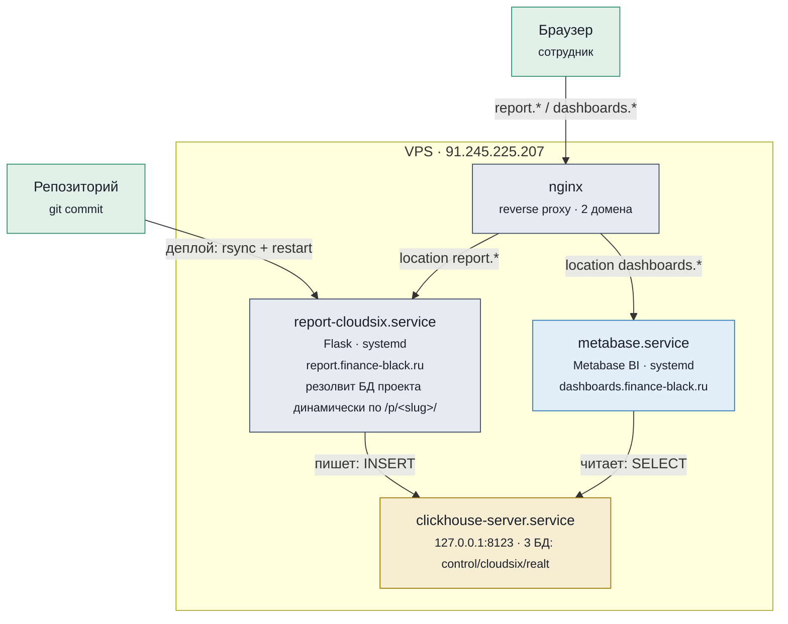
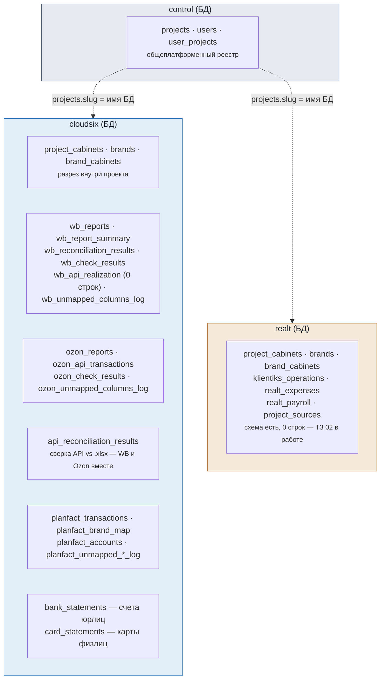
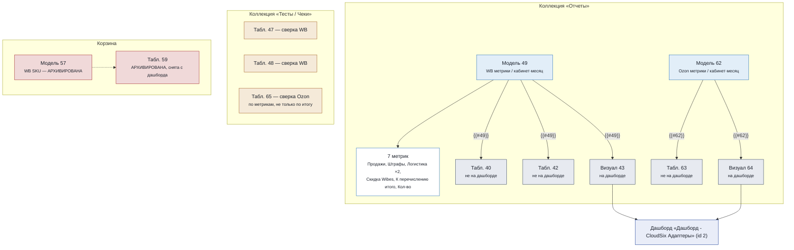

# Карта bf-analytics

Платформа принимает отчёты Wildberries и Ozon, банковские выписки и выгрузки ПланФакта, складывает их в единую базу и превращает в дашборды. Ниже — как это устроено на четырёх уровнях: код, сервисы, база данных, аналитика. Плюс путь одного отчёта и глоссарий — для тех, кто не программист.

Снимок структуры на **2026-09-13** (source of truth: `system.tables` ClickHouse на проде — все 3 БД, Metabase API, код репозитория). Предыдущий снимок был от 2026-09-05 — с тех пор добавился Ozon-коннектор (API + .xlsx, коммит `7129ea3`) и разграничение проектов по отдельным физическим БД (`e94595e`).

---

## 1. Как работают функции Python

Все загрузчики данных устроены одинаково: файл разбирается (или тянется по API), поля приводятся к общему справочнику названий, и результат пишется в ClickHouse. Различаются только источники — сам механизм один и тот же.

CLI-скрипты (разовые/периодические загрузки), веб-форма (ежедневные отчёты WB) и прямой запрос к API (Ozon) ведут в одни и те же функции — код не дублируется. Строки без соответствия в справочнике не роняют загрузку, а откладываются в лог-таблицу для разбора.

Восемь загрузчиков — один и тот же механизм, разные источники:

| Источник файла | Скрипт | Ключевая функция | Таблица ClickHouse |
|---|---|---|---|
| Детальный отчёт WB (.xlsx) | `ingest_wb.py` / веб-форма | `wb_core.ingest_files` | `wb_reports` |
| Сводный отчёт WB (.xlsx) | `ingest_wb.py` / веб-форма | `wb_summary_core.ingest_files` | `wb_report_summary` |
| Реализации WB (API) | `ingest_wb_api.py` | `wb_api_core.*` | `wb_api_realization` — **0 строк, загрузка не запускалась** (см. бэклог `docs/vision.md`) |
| Отчёт Ozon «Начисления» (.xlsx) | `ingest_ozon.py` | `ozon_core.ingest_files` | `ozon_reports` |
| Финансовые операции Ozon (API) | `ingest_ozon_api.py` | `ozon_api_core.ingest_period` | `ozon_api_transactions` |
| Банковская выписка 1С (.txt) | `ingest_bank_statements.py` | `bank_statement_1c.parse_dir` | `bank_statements` |
| Справка по карте физлица (.pdf) | `ingest_card_statements.py` | `card_statement_pdf.parse_dir` | `card_statements` |
| Выгрузка ПланФакта (.xlsx) | `ingest_planfact.py` | `planfact_xlsx.parse_xlsx` | `planfact_transactions` |
| Справочник брендов (Google Sheets) | `ingest_planfact_brand_map.py` | `parse_brand_map` / `parse_accounts` | `planfact_brand_map`, `planfact_accounts` |

**В процессе (2026-09-12, ТЗ 02):** для Реальта (первый клиент за пределами WB/Ozon) заведены модули `klientiks_core.py` и `realt_gsheets_core.py` со схемой (`schema_klientiks.sql`, `schema_realt_gsheets.sql`) — но CLI-обёрток `ingest_*.py` ещё нет, все таблицы в БД `realt` пустые (0 строк). Не отдельная строка в таблице выше, т.к. ещё не рабочий пайплайн.

---

## 2. Как связаны сервисы

Всё живёт на одном VPS. nginx решает, какой домен куда вести; веб-приложение только пишет данные, Metabase — только читает.

Один сервис пишет, другой только читает — Flask-приложение никогда не читается напрямую сотрудником для аналитики, а Metabase никогда не пишет в ClickHouse. Код на VPS обновляется вручную командой `scripts/deploy.sh` (rsync + перезапуск systemd), автодеплоя по пушу нет.

Название `report-cloudsix.service` — историческое (сервис создавался под первого и на тот момент единственного клиента); с 2026-09-12 он обслуживает несколько проектов через один и тот же процесс, выбирая БД по `/p/<slug>/` в URL, а не по своему имени.

---

## 3. Что лежит в ClickHouse

**С 2026-09-12 — три физические БД, не одна.** `control` — общеплатформенный реестр (кто есть кто), у каждого проекта-клиента — своя отдельная БД (имя = `projects.slug`) с бизнес-таблицами этого клиента. Сейчас это `cloudsix` (данные есть) и `realt` (схема заведена, данные ещё не загружены — ТЗ 02 в работе у Ильи).

Бренд для операции ПланФакта не записан в саму строку — он вычисляется JOIN'ом с `planfact_brand_map` в момент чтения. Это осознанное решение: справочник брендов меняется чаще, чем хочется перезаливать 23 тысячи строк.

### control

| Таблица | Строк | Назначение |
|---|---:|---|
| `projects` | 2 | Проекты-клиенты (CloudSix, Realt) |
| `users` | 1 | Сотрудники с доступом к платформе |
| `user_projects` | 1 | Какому сотруднику какие проекты видны |

### cloudsix

| Таблица | Группа | Строк | Назначение |
|---|---|---:|---|
| `project_cabinets` | ядро | 15 | Кабинеты площадки, привязанные к проекту |
| `brands` | ядро | 13 | Бренды внутри проекта — каждый на своём ИП/ООО |
| `brand_cabinets` | ядро | 15 | Связь бренда с конкретным кабинетом площадки |
| `wb_reports` | WB | 775 319 | Сырые строки детального отчёта WB |
| `wb_report_summary` | WB | 506 | Итоговые цифры сводного отчёта — для сверки |
| `wb_reconciliation_results` | WB | 6 072 | Результат сверки детального и сводного отчётов (ReplacingMergeTree — без FINAL считает версии, не уникальные проверки) |
| `wb_check_results` | WB | 54 | Технические проверки качества загрузки |
| `wb_api_realization` | WB | **0** | Реализации WB по API — **загрузка не запускалась**, см. `docs/vision.md` → бэклог |
| `wb_unmapped_columns_log` | WB | 34 | Колонки отчёта, не найденные в справочнике маппинга |
| `ozon_reports` | Ozon | 888 101 | Сырые строки отчёта Ozon «Начисления» (.xlsx) |
| `ozon_api_transactions` | Ozon | 179 434 | Финансовые операции Ozon по Seller API |
| `ozon_check_results` | Ozon | 42 | Технические проверки качества загрузки |
| `ozon_unmapped_columns_log` | Ozon | 0 | Колонки .xlsx, не найденные в справочнике маппинга |
| `api_reconciliation_results` | сверка | 184 | Сверка «API vs .xlsx» по метрикам модели — WB и Ozon в одной таблице (`platform`) |
| `planfact_transactions` | кэшфлоу | 23 591 | Сырая выгрузка операций из ПланФакта |
| `planfact_brand_map` | кэшфлоу | 15 | Справочник «проект ПланФакта → бренд/площадка» |
| `planfact_accounts` | кэшфлоу | 58 | Справочник банковских счетов ПланФакта |
| `planfact_category_mapping` | кэшфлоу | 0 | Заготовка под маппинг статей (пока не заполнена) |
| `planfact_unmapped_project_log` | кэшфлоу | 1 | Строки без бренда/площадки при загрузке |
| `planfact_unmapped_statya_log` | кэшфлоу | 0 | Строки без статьи при загрузке |
| `bank_statements` | банк | 13 854 | Сырые банковские выписки 1С — р/с юрлиц |
| `card_statements` | банк | 14 870 | Справки по картам физлиц (из PDF) |

Плюс 3 VIEW с формулами метрик (не таблицы с данными — см. раздел 4): `wb_metrics_by_cabinet_month`, `ozon_metrics_by_cabinet_month`, `ozon_metrics_by_cabinet_month_api`.

### realt

Схема заведена (`project_cabinets`, `brands`, `brand_cabinets`, `klientiks_operations`, `realt_expenses`, `realt_payroll`, `project_sources` + VIEW `realt_metrics_by_month`), но **все таблицы пустые** — ТЗ 02 (источники и метрики Реальта) передано Илье, не начато.

---

## 4. Как устроен Metabase

Формула метрики живёт один раз — в Модели. Всё остальное на неё ссылается, а не копирует SQL заново. Так после правки формулы все карточки обновляются сразу, без риска разойтись.

Модели 49 и 62 — единственное место, где считаются формулы метрик WB/Ozon (обе — тонкие обёртки над ClickHouse VIEW, см. `src/schema_wb_metrics_views.sql` / `src/schema_ozon_metrics_views.sql`). Карточки 40/42/63 существуют для ручных проверок, но на дашборд не выведены. Сверки (47, 48, 65) намеренно изолированы в коллекции «Тесты / Чеки» — это инструмент контроля, а не витрина для ежедневного просмотра.

**Найдено при сверке документации 2026-09-13:** Модель 57 («WB юнит-экономика по SKU») и карточка 59 — в Корзине (архивированы), сняты с дашборда. При этом 2 метрики, построенные поверх неё («Метрика - WB SKU Кол-во продаж» id 60, «Метрика - WB SKU К перечислению итого» id 61), остались **живыми** в коллекции «Отчеты» — ссылаются на архивную модель. Не разбирали, было ли архивирование намеренным; пока просто зафиксировано как факт.

**Обновление 2026-09-05** (актуально по сей день). У Модели 49 раньше не было ни одного способа
отфильтровать дашборд по кабинету — карточка 40/42 не выводила «Кабинет»
вообще, поэтому строки с одинаковым (месяц, метрика) по разным кабинетам
молча складывались, и Визуал 43 на дашборде показывал сумму по всем
кабинетам сразу. Исправлено:

- «Кабинет» добавлен в SELECT карточек 40/42 (`src/metabase_queries/wb_metrics_by_month.sql`) — теперь можно сделать breakout/фильтр по кабинету на самих карточках 40/42, но dashboard-фильтр «Кабинет» пока не заведён: Metabase запрещает переменные/Field Filter в Модели на native SQL, так что фильтр по кабинету на уровне Модели 49 — отдельная задача (см. вариант (а) в заголовке `wb_metrics_by_month.sql`);
- сами формулы метрик переехали из текста Модели 49 в ClickHouse VIEW
  `wb_metrics_by_cabinet_month` (`src/schema_wb_metrics_views.sql`) — Модель
  49 теперь тонкая обёртка над VIEW. Причина переноса — готовим слой к
  AI-боту по аналитике (см. ниже, «AI-бот и семантический слой»): формула,
  которая живёт только внутри Metabase, невидима для бота, если он
  обращается к ClickHouse напрямую. Тот же приём повторён 2026-09-08 для
  Ozon (`ozon_metrics_by_cabinet_month`, Модель 62 — сразу тонкая обёртка,
  без промежуточного этапа «формула только в Metabase»).

**Обновление 2026-09-13.** В обеих VIEW (`wb_metrics_by_cabinet_month`,
`ozon_metrics_by_cabinet_month`) починен один и тот же класс ошибки —
двойной счёт строк `document_type='Возврат'` в части формул (подробности:
вики-заметка [[WB loyalty-метрики теряют строки document_type IS NULL при наивном sumIf]]
и коммиты `b09b471`/`0e6bd37`). Реальный эффект на дашборде — `payable_total`
по WB был занижен на 1.4–3.3 тыс ₽/месяц за апрель-июль 2026.

## AI-бот и семантический слой

Платформа готовится к тому, что поверх встанет AI-бот, отвечающий на
аналитические вопросы. Архитектура доступа к данным для него (решение
2026-09-05, полное обоснование — `.claude/knowledge/architecture-standarts.md`
→ «Семантический слой для AI-бота»):

1. **Сначала Metabase REST API** — бот вызывает уже готовые Model/Metric
   через `POST /api/card/:id/query`, не гоняя большие данные в ClickHouse
   заново под уже посчитанный вопрос.
2. **Ad-hoc SQL к ClickHouse — только запасной путь**, если вопрос не
   покрыт существующей моделью, через отдельного read-only пользователя
   (завести до подключения бота к БД) и по VIEW-слою с `COMMENT COLUMN`
   (`wb_metrics_by_cabinet_month`, `ozon_metrics_by_cabinet_month`), а не по
   сырым таблицам.
3. **OpenMetadata не берём** — рассчитан на multi-source enterprise-каталоги,
   у нас один ClickHouse и один Metabase, лишний сервис (Postgres/MySQL +
   Elasticsearch) не окупается при текущем масштабе. Глоссарий терминов
   (раздел 6 ниже) остаётся текстовым источником семантики.

Разграничение по трём физическим БД (раздел 3) не меняет эту архитектуру —
read-only пользователь для бота нужно будет завести на каждую БД клиента
отдельно (или на все сразу, если бот должен видеть несколько проектов), см.
бэклог «Узкие ClickHouse-пользователи для Metabase» в `docs/vision.md` —
тот же незакрытый вопрос актуален и для будущего бота.

---

## 5. Путь одного отчёта

Что происходит между «выгрузил файл из личного кабинета» и «увидел цифру в дашборде» — по шагам (на примере WB; для Ozon то же самое, только раздел 4 «Загрузка» может быть либо .xlsx через тот же принцип, либо автоматическим запросом к API без участия сотрудника):

1. **Выгрузка** — сотрудник скачивает отчёт из личного кабинета WB в .xlsx
2. **Загрузка** — заходит на report.finance-black.ru, выбирает проект и кабинет, загружает файл
3. **Разбор** — платформа читает файл, приводит колонки к общему виду, пишет строки в ClickHouse (в БД нужного проекта)
4. **Сверка** — для сводного отчёта сразу считается сверка с детальным, расхождения видны в самой форме
5. **Модель** — Metabase пересчитывает формулы метрик заново при каждом открытии, без ручного шага
6. **Дашборд** — на dashboards.finance-black.ru видна выручка, маржа и удержания площадки

---

## 6. Глоссарий

Слова, которые платформа использует в специфичном смысле.

**Проект**
Клиент платформы (сейчас два — CloudSix и Реальт, второй ещё без данных). Верхний уровень, к которому привязаны пользователи, кабинеты и бренды; у каждого проекта — своя физическая БД в ClickHouse.

**Кабинет**
Учётная запись продавца на площадке (WB, Ozon). Один проект может держать несколько кабинетов.

**Бренд**
Товарная линейка внутри проекта, обычно оформленная на своё юрлицо/ИП. У CloudSix — 13 брендов на 13 юрлицах внутри одного проекта.

**Модель** (Metabase Model)
Зафиксированный SQL-запрос с формулами метрик. Единственное место, где формула написана — остальные карточки на неё ссылаются, а не копируют код.

**Метрика** (Metabase Metric)
Готовая агрегация поверх Модели (например, сумма по колонке «Продажи»), которую можно переиспользовать как блок в других карточках.

**Сверка**
Автоматическое сравнение цифр между двумя независимыми источниками одной и той же площадки — либо детальный vs сводный отчёт внутри WB (`wb_reconciliation_results`), либо API vs .xlsx для WB/Ozon (`api_reconciliation_results`), причём и по общей сумме, и по каждой метрике модели отдельно.

**ingest**
Загрузка сырого файла или ответа API в ClickHouse: разбор/запрос → маппинг колонок → запись строк.

---

*bf-analytics-platform · снимок структуры на 2026-09-13 · источники: `system.tables` ClickHouse (control/cloudsix/realt), Metabase API, код репозитория*
