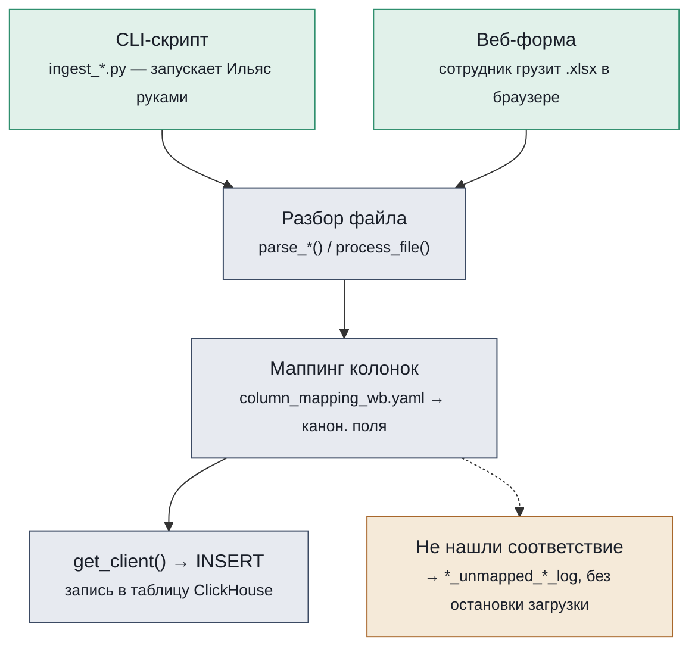
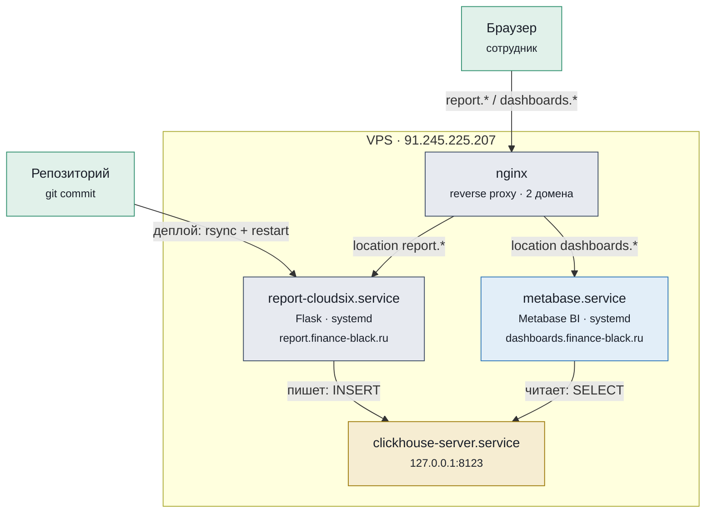
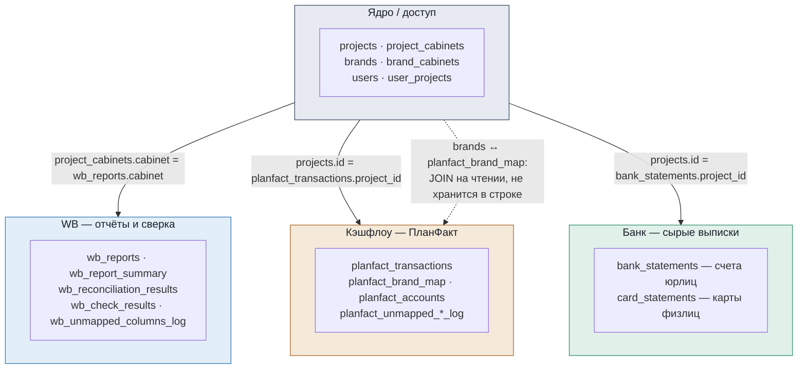
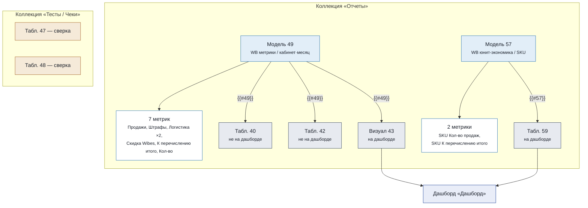

# Карта bf-analytics

Платформа принимает отчёты Wildberries, банковские выписки и выгрузки ПланФакта, складывает их в единую базу и превращает в дашборды. Ниже — как это устроено на четырёх уровнях: код, сервисы, база данных, аналитика. Плюс путь одного отчёта и глоссарий — для тех, кто не программист.

Снимок структуры на **2026-09-05** (source of truth: `system.tables` ClickHouse на проде, Metabase API, код репозитория).

---

## 1. Как работают функции Python

Все загрузчики данных устроены одинаково: файл разбирается, поля приводятся к общему справочнику названий, и результат пишется в ClickHouse. Различаются только источники — сам механизм один и тот же.

CLI-скрипты (разовые загрузки) и веб-форма (ежедневные отчёты WB) ведут в одни и те же функции — код не дублируется. Строки без соответствия в справочнике не роняют загрузку, а откладываются в лог-таблицу для разбора.

Шесть загрузчиков — один и тот же механизм, разные источники:

| Источник файла | Скрипт | Ключевая функция | Таблица ClickHouse |
|---|---|---|---|
| Детальный отчёт WB (.xlsx) | `ingest_wb.py` / веб-форма | `wb_core.ingest_files` | `wb_reports` |
| Сводный отчёт WB (.xlsx) | `ingest_wb.py` / веб-форма | `wb_summary_core.ingest_files` | `wb_report_summary` |
| Банковская выписка 1С (.txt) | `ingest_bank_statements.py` | `bank_statement_1c.parse_dir` | `bank_statements` |
| Справка по карте физлица (.pdf) | `ingest_card_statements.py` | `card_statement_pdf.parse_dir` | `card_statements` |
| Выгрузка ПланФакта (.xlsx) | `ingest_planfact.py` | `planfact_xlsx.parse_xlsx` | `planfact_transactions` |
| Справочник брендов (Google Sheets) | `ingest_planfact_brand_map.py` | `parse_brand_map` / `parse_accounts` | `planfact_brand_map`, `planfact_accounts` |

---

## 2. Как связаны сервисы

Всё живёт на одном VPS. nginx решает, какой домен куда вести; веб-приложение только пишет данные, Metabase — только читает.

Один сервис пишет, другой только читает — Flask-приложение никогда не читается напрямую сотрудником для аналитики, а Metabase никогда не пишет в ClickHouse. Код на VPS обновляется вручную командой `scripts/deploy.sh` (rsync + перезапуск systemd), автодеплоя по пушу нет.

---

## 3. Что лежит в ClickHouse

20 таблиц, сгруппированных по назначению. Всё привязано к проекту либо напрямую (`project_id`), либо через кабинет площадки — кроме бренда, который не хранится в фактах, а вычисляется на лету.

Бренд для операции ПланФакта не записан в саму строку — он вычисляется JOIN'ом с `planfact_brand_map` в момент чтения. Это осознанное решение: справочник брендов меняется чаще, чем хочется перезаливать 23 тысячи строк.

Полный список таблиц:

| Таблица | Группа | Строк | Назначение |
|---|---|---:|---|
| `projects` | ядро | 1 | Проект-клиент (сейчас один — CloudSix) |
| `project_cabinets` | ядро | 1 | Кабинеты площадки, привязанные к проекту |
| `brands` | ядро | 13 | Бренды внутри проекта — каждый на своём ИП/ООО |
| `brand_cabinets` | ядро | 1 | Связь бренда с конкретным кабинетом площадки |
| `users` | ядро | 2 | Сотрудники с доступом к платформе |
| `user_projects` | ядро | 1 | Какому сотруднику какие проекты видны |
| `wb_reports` | WB | 351 803 | Сырые строки детального отчёта WB |
| `wb_report_summary` | WB | 506 | Итоговые цифры сводного отчёта — для сверки |
| `wb_reconciliation_results` | WB | 3 036 | Результат сверки детального и сводного отчётов |
| `wb_check_results` | WB | 12 | Технические проверки качества загрузки |
| `wb_income_expenses` | WB | 1 | Заготовка под доходы/расходы (почти не используется) |
| `wb_unmapped_columns_log` | WB | 8 | Колонки отчёта, не найденные в справочнике маппинга |
| `planfact_transactions` | кэшфлоу | 23 591 | Сырая выгрузка операций из ПланФакта |
| `planfact_brand_map` | кэшфлоу | 15 | Справочник «проект ПланФакта → бренд/площадка» |
| `planfact_accounts` | кэшфлоу | 58 | Справочник банковских счетов ПланФакта |
| `planfact_category_mapping` | кэшфлоу | 0 | Заготовка под маппинг статей (пока не заполнена) |
| `planfact_unmapped_project_log` | кэшфлоу | 1 | Строки без бренда/площадки при загрузке |
| `planfact_unmapped_statya_log` | кэшфлоу | 0 | Строки без статьи при загрузке |
| `bank_statements` | банк | 13 854 | Сырые банковские выписки 1С — р/с юрлиц |
| `card_statements` | банк | 14 870 | Справки по картам физлиц (из PDF) |

---

## 4. Как устроен Metabase

Формула метрики живёт один раз — в Модели. Всё остальное на неё ссылается, а не копирует SQL заново. Так после правки формулы все карточки обновляются сразу, без риска разойтись.

Модели 49 и 57 — единственное место, где считаются формулы метрик WB. Карточки 40 и 42 существуют для ручных проверок, но на дашборд не выведены. Сверки (47, 48) намеренно изолированы в отдельной коллекции — это инструмент контроля, а не витрина для ежедневного просмотра.

---

## 5. Путь одного отчёта

Что происходит между «выгрузил файл из личного кабинета WB» и «увидел цифру в дашборде» — по шагам:

1. **Выгрузка** — сотрудник скачивает отчёт из личного кабинета WB в .xlsx
2. **Загрузка** — заходит на report.finance-black.ru, выбирает кабинет, загружает файл
3. **Разбор** — платформа читает файл, приводит колонки к общему виду, пишет строки в ClickHouse
4. **Сверка** — для сводного отчёта сразу считается сверка с детальным, расхождения видны в самой форме
5. **Модель** — Metabase пересчитывает формулы метрик заново при каждом открытии, без ручного шага
6. **Дашборд** — на dashboards.finance-black.ru видна выручка, маржа и удержания площадки

---

## 6. Глоссарий

Слова, которые платформа использует в специфичном смысле.

**Проект**
Клиент платформы (сейчас один — CloudSix). Верхний уровень, к которому привязаны пользователи, кабинеты и бренды.

**Кабинет**
Учётная запись продавца на площадке (WB, в перспективе — Ozon). Один проект может держать несколько кабинетов.

**Бренд**
Товарная линейка внутри проекта, обычно оформленная на своё юрлицо/ИП. У CloudSix — 13 брендов на 13 юрлицах внутри одного проекта.

**Модель** (Metabase Model)
Зафиксированный SQL-запрос с формулами метрик. Единственное место, где формула написана — остальные карточки на неё ссылаются, а не копируют код.

**Метрика** (Metabase Metric)
Готовая агрегация поверх Модели (например, сумма по колонке «Продажи»), которую можно переиспользовать как блок в других карточках.

**Сверка**
Автоматическое сравнение цифр детального и сводного отчёта WB по каждой статье — показывает, не разошлись ли данные.

**ingest**
Загрузка сырого файла в ClickHouse: разбор → маппинг колонок → запись строк.

---

*bf-analytics-platform · снимок структуры на 2026-09-05 · источники: `system.tables` ClickHouse, Metabase API, код репозитория*
